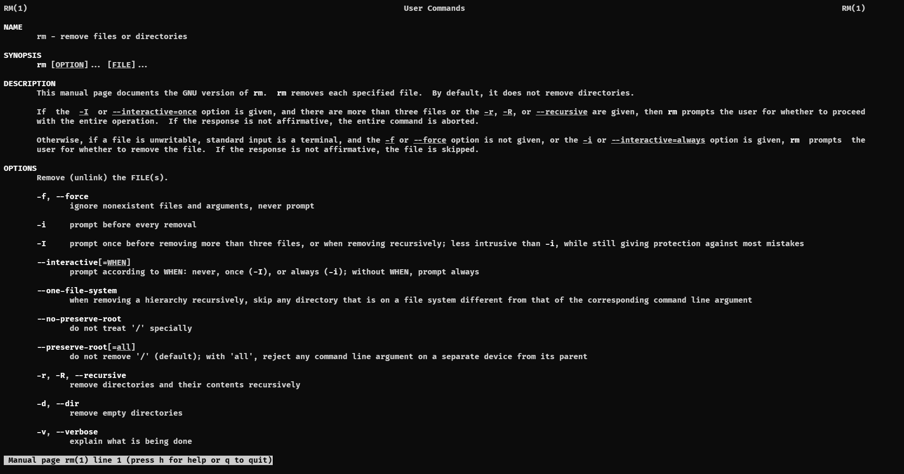

# Linux Basic Command

## ls command

    ls <option> <arguments>

เป็นคำสั่งที่ใช้แสดงรายการ file และ directory ทั้งหมดในตำแหน่งที่ต้องการแสดง

Example

    pi@practicum:~$ ls /usr
    bin  games  include  lib  lib32  lib64  libexec  libx32  local  sbin  share  src

แสดง file และ directory ที่ diretory /usr

    ls -la หรือ ls -a -l

`-a` หมายถึง โชว์ไฟล์ที่ถูกซ่อนด้วย (ไฟล์ที่ขึ้นต้นด้วย `.`)

`-l` หมายถึง โชว์รายละเอียดอื่น ๆ เช่น วันที่สร้าง ขนาด ฯลฯ

output ที่ใช้คำสั่ง `ls -la` ที่ directory ปัจจุบัน (`/etc`)

    pi@practicum:/etc $ ls -la
    total 896
    drwxr-xr-x 88 root root    4096 Dec 16 10:05 .
    drwxr-xr-x 18 root rbashoot    4096 Sep 22 10:06 ..
    -rw-r--r--  1 root root    2981 Sep 22 09:49 adduser.conf
    drwxr-xr-x  2 root root    4096 Nov  9 14:17 alternatives
    drwxr-xr-x  3 root root    4096 Nov  9 11:49 apache2
    drwxr-xr-x  3 root root    4096 Nov  9 11:46 apparmor.d
    drwxr-xr-x  8 root root    4096 Nov 17 12:03 apt
    drwxr-xr-x  3 root root    4096 Sep 22 09:53 avahi
    -rw-r--r--  1 root root    1994 Mar 28  2022 bash.bashrc
    -rw-r--r--  1 root root      45 Jan 25  2020 bash_completion
    .
    .
    .

## การเปลี่ยน Directory

| Command          | คำอธิบาย                                           |
| ---------------- | -------------------------------------------------- |
| `pwd`            | แสดง directory ปัจจุบันขึ้นมา                      |
| `cd / `          | เปลี่ยน directory ไปยัง root                       |
| `cd ~` หรือ `cd` | เปลี่ยน current directory ไปยัง /home/username/    |
| `cd ..`          | หมายถึง ถอย back ออกจาก directory ปัจจุบัน 1 ครั้ง |

### example

```bash
pi@practicum:~ $ pwd
/home/pi
```

```bash
pi@practicum:/ $ cd /etc/
pi@practicum:/etc $
```

```bash
pi@practicum:/etc $ cd
pi@practicum:~ $
```

## การแสดงเนื้อหาของไฟล์

| command | คำอธิบาย                                                         |
| ------- | ---------------------------------------------------------------- |
| `cat`   | แสดงเนื้อหาทั้งหมดของไฟล์                                        |
| `more`  | แสดงเนื้อหาทั้งหมดของไฟล์ โดยสามารถเลื่อนลงในเอกสารได้อย่างเดียว |
| `less`  | แสดงเนื้อหาของไฟล์ โดยสามารถเลื่อนขึ้นและลงในเอกสารได้           |
| `head`  | แสดงเนื้อหา 10 บรรทัดแรกของไฟล์                                  |
| `tail`  | แสดงเนื้อหา 10 บรรทัดสุดท้ายของไฟล์                              |

โดยคำสั่ง `cat more less head tail`นั้นจะต้องตามด้วยชื่อไฟล์ข้อความเช่น /etc/passwd

### example

```bash
pi@practicum:~ $ cat /etc/passwd
root:x:0:0:root:/root:/bin/bash
daemon:x:1:1:daemon:/usr/sbin:/usr/sbin/nologin
bin:x:2:2:bin:/bin:/usr/sbin/nologin
sys:x:3:3:sys:/dev:/usr/sbin/nologin
sync:x:4:65534:sync:/bin:/bin/sync
games:x:5:60:games:/usr/games:/usr/sbin/nologin
man:x:6:12:man:/var/cache/man:/usr/sbin/nologin
.
.
.
```

## คำสั่งการย้าย คัดลอก และ ลบไฟล์

| command | คำอธิบาย                                                                |
| ------- | ----------------------------------------------------------------------- |
| `mv`    | ย้ายไฟล์ ประกอบด้วย 2 arguments `mv <src> <destination>`                |
| `cp`    | copy ไฟล์ ประกอบด้วย 2 arguments `cp <src> <destination>`               |
| `rm`    | ลบไฟล์ประกอบด้วย 1 option 1 argument `rm -option <destination>`         |
| `wc`    | แสดงจำนวนบรรทัด คำ ตัวอักษร byte และความยาวของบรรทัดที่ยาวที่สุดของไฟล์ |

**คำเตือน** คำสั่ง `rm` ควรจะใช้เป็น `rm -i` เสมอ เพื่อจะให้มีการถามก่อนลบเสมอ
**หมายเหตุ** คำสั่ง `rm` ถ้าจะลบ directory ให้ใช้ `rmdir` หรือ `rm -r`

### example

```bash
pi@practicum:~/Downloads $ rm -i file.extension
rm: remove regular file 'file.extension'?
```

## ดูคู่มือการใช้งานแต่ละคำสั่ง

`man <ชื่อคำสั่ง>` คำสั่งนี้จะได้คู่มือการใช้งานคำสั่งแต่ละคำสั่งออกมาเลย

### example

```bash
pi@practicum:~/Downloads $ man rm
```



## การสร้าง directory และ ไฟล์

| command | คำอธิบาย                                           |
| ------- | -------------------------------------------------- |
| `touch` | สร้างไฟล์เปล่าๆขึ้นมา โดย `touch <filename>`       |
| `mkdir` | สร้าง directory เปล่าๆขึ้นมา โดย `mkdir <dirname>` |
