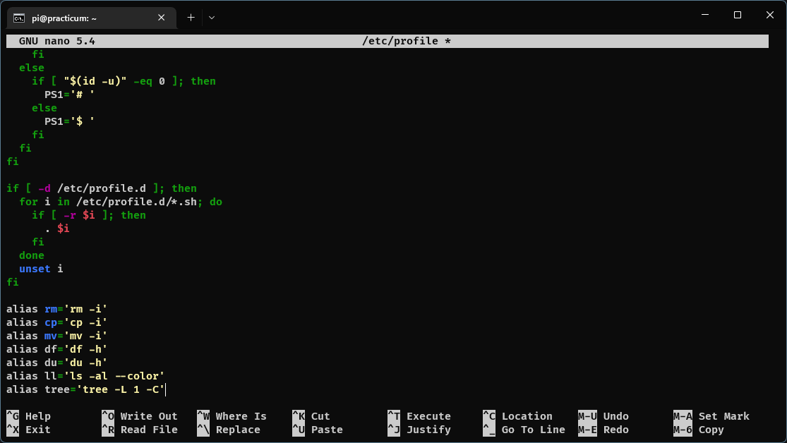

# การ config สำหรับ user ทุกคน

ก่อนอื่น login เป็น root ก่อนเสมอด้วยคำสั่งตามนี้

```bash
sudo su
```

ผลลัพธ์

```bash
root@practicum:/home/pi#
```

## เพิ่ม alias ที่จำเป็น ใน /etc/profile

```
vi /etc/profile
```

หรือ

```
pico /etc/profile
```

แล้วเลื่อนไปบรรทัดล่างสุดแล้ว copy & paste ข้อความข้างล่าง

```
alias rm='rm -i'
alias cp='cp -i'
alias mv='mv -i'
alias df='df -h'
alias du='du -h'
alias ll='ls -al --color'
alias tree='tree -L 1 -C'
```

ตามภาพนี้เลย

แล้วออกจาก nano หรือ vi

ให้ logout แล้ว remote ssh ใหม่
ก็จะใช้คำสั่งเพิ่มเติมไว้แล้ว

## ตั้งค่า .vimrc

ก่อนตั้งค่า รันคำสั่งข้างล่างก่อน เพื่ออัพเดทระบบให้ใหม่ที่สุดก่อน

```
apt update && apt upgrade
```

```
286 upgraded, 25 newly installed, 0 to remove and 1 not upgraded.
Need to get 953 MB of archives.
After this operation, 292 MB of additional disk space will be used.
Do you want to continue? [Y/n] <-- กด Y แล้ว Enter
```
*จำนวน package ที่จะ update อาจจะมีจำนวนที่แตกต่างกัน

พิมพ์คำสั่งตามนี้

```bash
pico /etc/vim/vimrc
```

หรือ

```bash
vi /etc/vim/vimrc
```

แล้วเลื่อนไปข้างล่างสุดแล้ว copy & paste ข้อความนี้

```
syntax on
set tabstop=2
set shiftwidth=2
set expandtab
set nu
```
