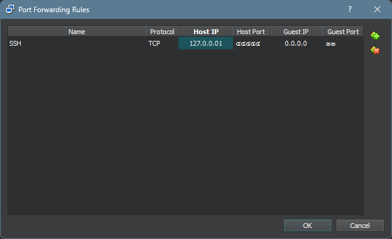
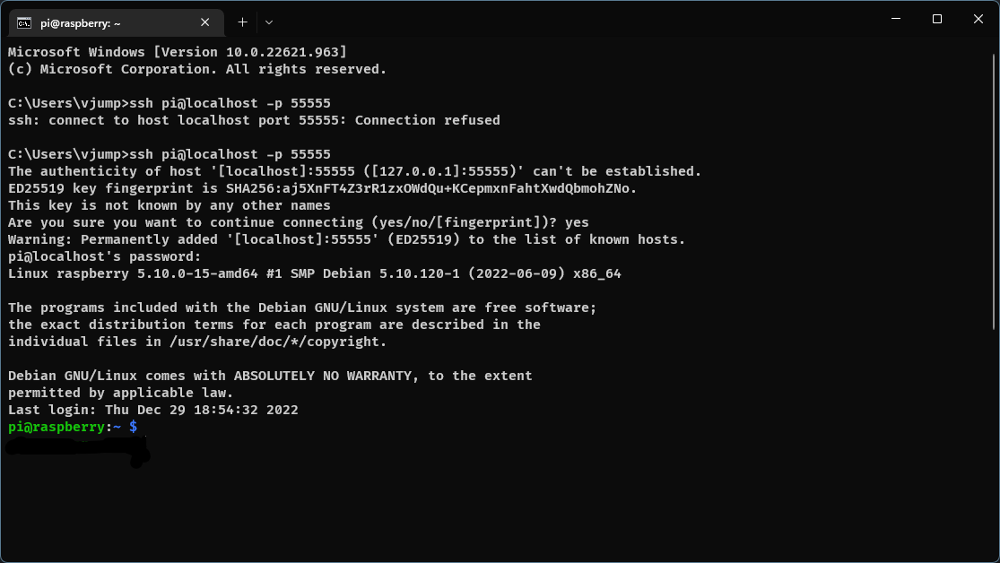

# เปิดการใช้งาน SSH

ก่อนที่จะเปิด ssh นั้น โปรดตรวจสอบก่อนว่า ได้ทำการ port forwarding พอร์ต 22 ใน virtualbox หรือยัง ?



1. เปิด terminal ใน Raspberry pi OS virtual machine ที่สร้างขึ้นมา


พิมพ์คำสั่งตามนี้

```
sudo systemctl enable ssh
```

```
sudo systemctl start ssh
```

เพื่อให้เวลาเปิด raspberry pi os ขึ้นมาให้รันโปรแกรม ssh ทุกครั้ง และ สั่งให้รันโปรแกรม ssh ตอนนี้

# Connecting to Raspberry Pi OS

เมื่อเปิดคำสั่งนี้แล้ว ให้ใช้ Putty หรือ Command Prompt ในการ remote ssh เข้าไปยัง Raspberry pi OS virtual machine

```
ssh pi@localhost -p 55555
```

เสร็จแล้วจะขึ้นหน้าต่างนี้ขึ้นมา

```
The authenticity of host '[localhost]:55555 ([127.0.0.1]:55555)' can't be established.
ED25519 key fingerprint is SHA256:xxx.
This key is not known by any other names
Are you sure you want to continue connecting (yes/no/[fingerprint])?
```

ให้ตอบว่า `yes` แล้วใส่ password ที่ตั้งไว้

ก็จะสามารถ remote ssh เข้ามายัง Raspberry pi OS virtual machine ได้


